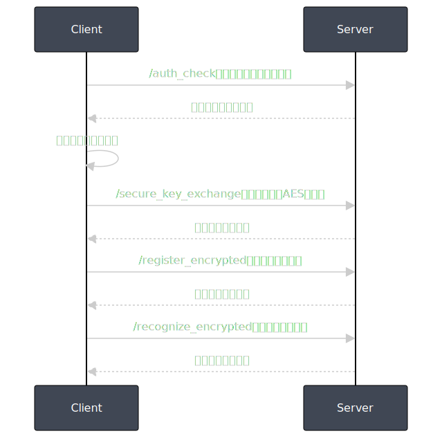

# 人脸识别与CSV远程认证系统（重构版）

## 目录结构
```
face-tee/
  ├── face_tee/                # 主包
  │   ├── __init__.py
  │   ├── server.py            # Flask服务主入口
  │   ├── client.py            # 客户端主入口
  │   ├── attestation.py       # CSV认证相关
  │   ├── crypto_utils.py      # 加解密工具
  │   ├── db.py                # 数据库操作
  │   ├── face.py              # 人脸识别相关
  │   └── config.py            # 配置
  ├── images/
  ├── requirements.txt
  ├── README.md
```

## 启动服务端
```bash
python -m face_tee.server
```

## 启动客户端
```bash
python -m face_tee.client
```

## 主要模块说明
- `crypto_utils.py`：AES-GCM加解密工具
- `db.py`：数据库初始化、存储、查询
- `face.py`：人脸特征提取与比对
- `attestation.py`：CSV认证相关
- `config.py`：全局配置

## 依赖安装
```bash
pip install -r requirements.txt
```

## 其余功能、接口、流程与原版一致。

## 运行流程图

下图展示了客户端与服务端的典型交互流程：

